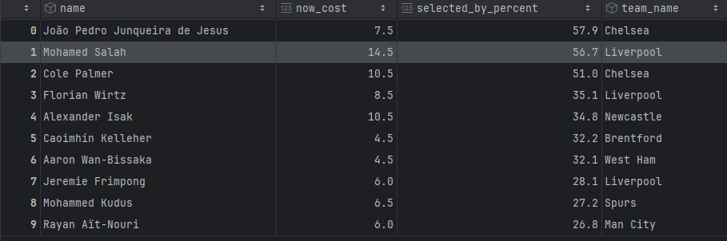

# fpl-insights 📊

**A Python project for analyzing Fantasy Premier League (FPL) data.**  
Fetches teams, players, fixtures, and player stats from the official FPL API and stores them in a local SQLite database for querying and analysis.

---

## 🚀 How to Run the Project

### 1. Clone the repository
```bash
git clone https://github.com/goranJankovic/fpl-insights.git
cd fpl-insights
```

### 2. Install dependencies
```bash
pip install -r requirements.txt
```

### 3. Fetch and store FPL data
```bash
python main.py
```

### 4. Analyze data with SQLite
```bash
sqlite3 fpl_data.db
```

---

## 📦 Requirements

- Python **3.8+**
- SQLite3 (**built-in** with Python)
- Required libraries (installed via `requirements.txt`):
  - `requests`
  - `tabulate`
  - `notebook`

---

## ✅ Features

- 🔄 Fetches teams, players, fixtures, and stats from the FPL API
- 🗃️ Stores data in a local SQLite database
- 🔍 Enables SQL-based analysis
- 🧰 Lightweight and easy to extend

---

## 🔍 Example SQL Queries

### Get players with teams and positions:
```sql
SELECT players.first_name, players.second_name, teams.name AS team, element_types.name AS position
FROM players
JOIN teams ON players.team_id = teams.id
JOIN element_types ON players.element_type = element_types.id;
```

### Top 10 players by total points:
```sql
SELECT first_name, second_name, total_points
FROM players
ORDER BY total_points DESC
LIMIT 10;
```

---

## 🧠 Example: Player History Preview

```bash
python get_player_history.py 328  # Example: Salah (ID 328)
```

Output:
```
GW | Points | Goals | Assists | CS | Home | H-Score | A-Score | Bonus | xG | xA | Transfers In | Transfers Out | Kickoff Time
---------------------------------------------------------------------------------------------------------------
 1 |     14 |     1 |       1 |  1 |    0 |       0 |       2 |     3 | 0.70 | 0.15 |            0 |            0 | 2024-08-17T11:30:00Z
 2 |     10 |     1 |       0 |  1 |    1 |       2 |       0 |     2 | 0.50 | 0.25 |       262302 |        64190 | 2024-08-25T15:30:00Z
 3 |     17 |     1 |       2 |  1 |    0 |       0 |       3 |     3 | 0.50 | 0.63 |       308526 |       186127 | 2024-09-01T15:00:00Z
```

---

## 📊 Jupyter Notebook Support

You can explore and analyze FPL data interactively via Jupyter Notebooks:

```bash
jupyter notebook
```

An example notebook is included:  
📄 `fpl_query_example.ipynb`

It demonstrates how to:
- Run SQL queries on `fpl_data.db`
- Load results into `pandas.DataFrame`
- Display results using `tabulate`
- Prepare for visualizations with `matplotlib` or `seaborn` *(optional)*

---

### 🔍 Example Jupyter Output Preview



## 🛠️ Future Improvements

- 📈 Add advanced visualizations and charts
- 🌐 Provide a REST API interface for external use
- 🧪 Add tests and validation

---

## 🤝 Contributions

Contributions are welcome!  
Feel free to fork the repo, open issues, or submit pull requests.

---

## 📞 Repository

GitHub: [fpl-insights](https://github.com/goranJankovic/fpl-insights)
Email: `jankovicsrb@gmail.com`

---

## 🏆 Enjoy exploring FPL data!


